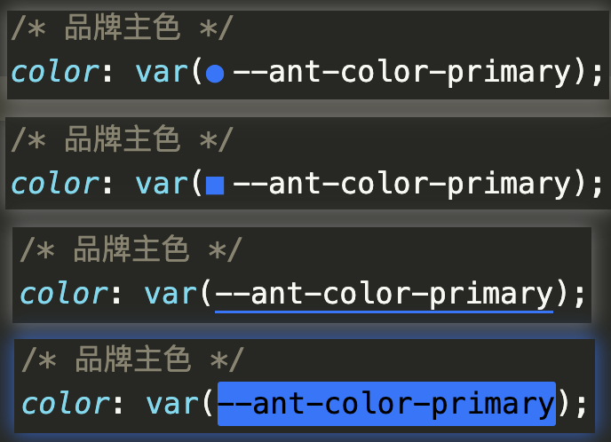
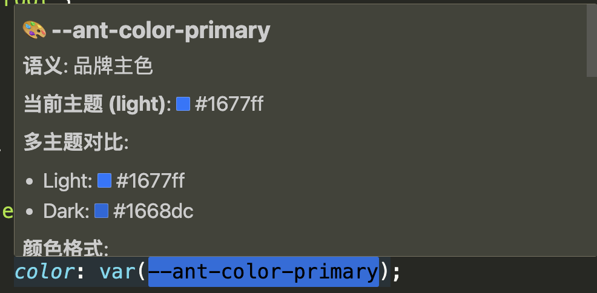
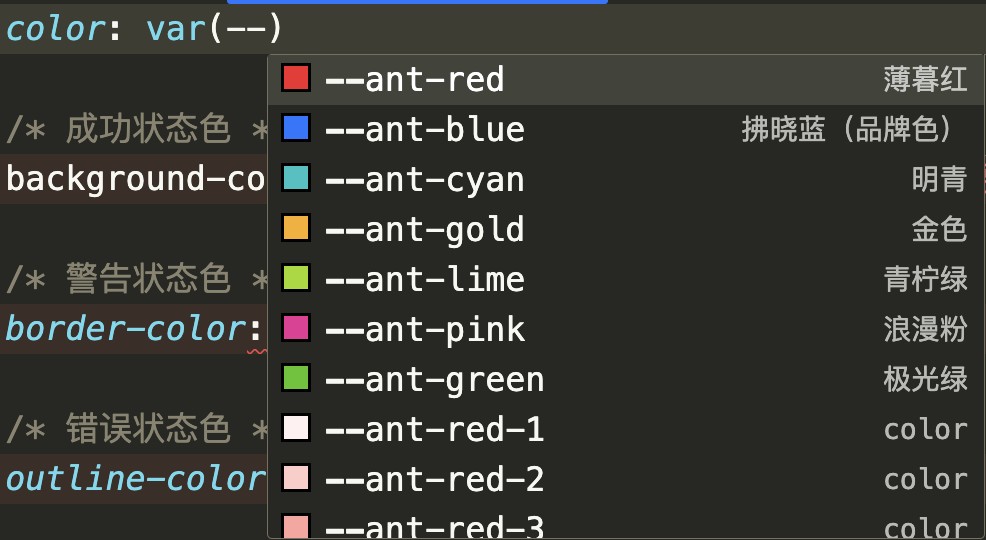
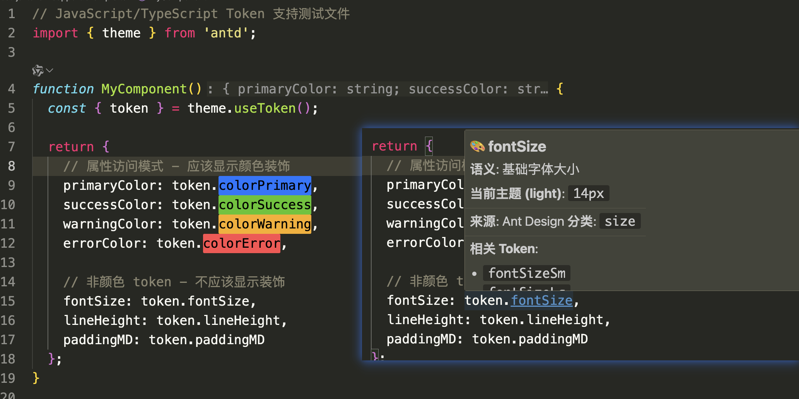
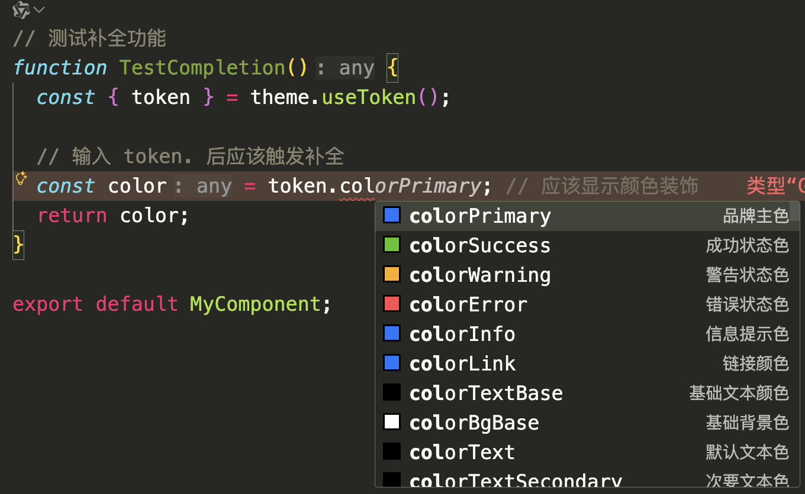
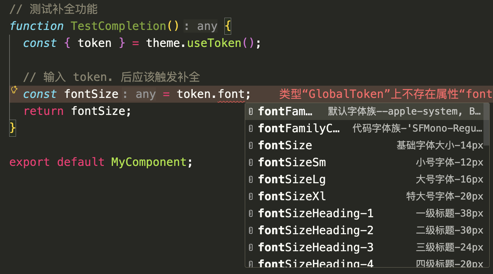
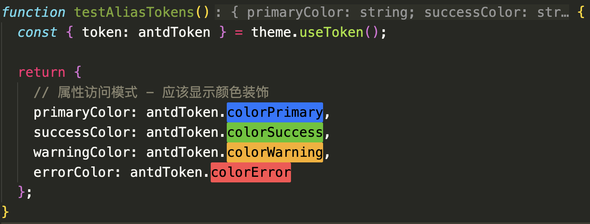
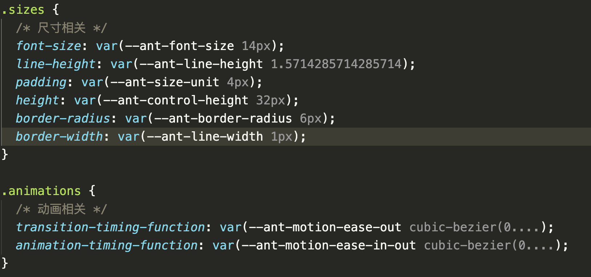
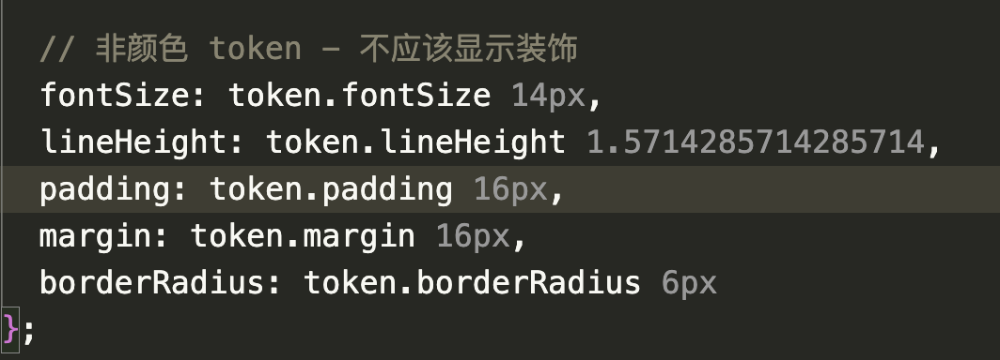

# Ant Design Token Lens VS Code 插件

一款让 Ant Design Token 在 VS Code 中「可见、可理解、可操作」的插件。

## 插件效果


## 为什么会需要这个插件

Ant Design 提供了 `useToken` 和 `getDesignToken` 来获取 Design Token，但仅限于 React 运行时环境。在 `.css`、`.less` 等样式文件中，或者结合 `Tailwind CSS` 开发时，直接使用这些 JS 变量往往存在限制。

特别是 Design Token 在 `Tailwind CSS` 中通常**不生效**，只能退化为**行内样式**使用。

作为一名 `Tailwind CSS` 使用者，我希望能直观地看到 Token 的实际效果，而不是面对抽象的变量名。为了解决这一痛点，让 Token 在 VS Code 中真实“可见”，本插件应运而生。

```html
<!-- 不生效 -->
<div className="{`text-[${token.colorPrimary}]`}"></div>
<!-- 生效 -->
<div className="text-[var(--ant-color-primary)]"></div>
<div className="text-(--ant-color-primary)"></div>
```

`Tailwind CSS` 是在构建时（Build Time）生成样式的，而 `token.colorPrimary` 是一个 运行时（Runtime） 的 `JavaScript` 变量。

核心区别：静态字符串 vs 动态插值

#### `text-[var(--ant-color-primary)]`/`text-(--ant-color-primary)` 为什么可行？

- 构建阶段：`Tailwind` 扫描器在源码中看到了 `text-[var(--ant-color-primary)]`/`text-(--ant-color-primary)` 这个完整的静态字符串。它不需要执行 JS，就知道你要一个任意值工具类。
- 生成 CSS：它提取中括号里的内容，直接生成如下 CSS 规则：
- 运行阶段：浏览器读取这行 CSS。此时 Ant Design 已经（通过 JS）把 `--ant-color-primary` 注入到了 html 或 body 标签上，浏览器成功解析了变量，颜色生效。

#### `text-[${token.colorPrimary}]` 为什么不可行？

- 构建阶段：`Tailwind` 扫描器看到的是 `text-[${token.colorPrimary}]`。这是一个包含变量的模板字符串。
- 无法预测：`Tailwind` 只进行静态文本分析，它不执行 `JavaScript`。它无法预知 `token.colorPrimary` 到底会变成 `#1677ff` 还是 `red`。
- 结果：因为无法确定类名，`Tailwind` 放弃生成任何 CSS。
- 运行阶段：虽然 React 把类名渲染成了 `text-[#1677ff]`，但对应的 CSS 规则根本不存在，所以颜色不生效。

## 项目介绍

在使用 Ant Design v5/v6 进行前端开发时，CSS Token（如 `--ant-color-primary`）是抽象的，开发者无法直观看到真实颜色效果。本插件旨在解决这个痛点，让 Token 使用更加直观和高效。

## 功能特性

### ✅ 已完成（阶段1 + 阶段2 + 阶段3 + 阶段4 + 阶段5 + 阶段6）

#### 阶段1：Token 数据管理

- ✅ Token 数据管理：完整的 Token 注册表和查询系统
- ✅ 主题管理：自动检测和切换 Light/Dark 主题
- ✅ 高性能：10000 次查询仅需 1ms
- ✅ 类型安全：完整的 TypeScript 类型定义
- ✅ 完善测试：35 个测试用例

#### 阶段2：颜色可视化

- ✅ **智能扫描**：自动识别代码中的 `var(--ant-*)` Token
- ✅ **颜色装饰**：在编辑器中直接显示 Token 对应的颜色
- ✅ **实时更新**：编辑代码或切换主题时自动更新颜色显示
- ✅ **多样式支持**：方形、圆形、下划线、背景等多种装饰样式
- ✅ **多文件支持**：支持 CSS、Less、Sass、JavaScript、TypeScript、JSX/TSX、Vue、HTML
- ✅ **高性能**：1000 行文件扫描 < 50ms，支持大文件
- ✅ **可配置**：灵活的样式、位置、大小配置



#### 阶段3：Hover 信息提示

- ✅ **智能悬浮提示**：鼠标悬停显示 Token 详细信息
- ✅ **多主题对比**：同时显示 Light 和 Dark 主题的颜色值
- ✅ **颜色格式转换**：HEX、RGB、HSL 等多种格式
- ✅ **颜色预览增强**：带边框的颜色块，直观清晰
- ✅ **分级信息展示**：Minimal、Normal、Detailed 三种模式
- ✅ **快捷命令**：复制值、查找引用、切换主题等
- ✅ **性能优化**：缓存机制、防抖处理，响应 < 100ms



#### 阶段4：智能自动补全

- ✅ **智能触发**：输入 `var(--` 或 `--ant` 或者 `-(-)` 自动弹出补全
- ✅ **上下文感知**：根据位置自动选择正确的插入格式
- ✅ **智能排序**：最近使用优先、完全匹配优先、分类优先
- ✅ **丰富信息**：显示 Token 名称、描述、当前值、颜色预览
- ✅ **性能优化**：多级缓存、增量过滤，响应 < 200ms
- ✅ **Snippet 支持**：自动插入 `var()` 语法，支持 fallback 参数
- ✅ **高度可配置**：详细程度、最近使用等多项配置



#### 阶段5：JavaScript/TypeScript Token 支持（v0.2.0）

- ✅ **颜色装饰**：高亮显示 `token.colorPrimary` (别名可也) 对应的实际颜色（与 CSS Token 相同风格）
- ✅ **Hover 预览**：悬停在 `token.xxx` 上即可查看颜色块、当前值、描述信息和分类
- ✅ **代码补全**：输入 `token.` 后自动弹出 camelCase Token 名称建议，带颜色预览
- ✅ **智能过滤**：只匹配注册表中实际存在的 Token，无误匹配
- ✅ **可配置**：通过 `antdToken.enableJsSupport` 配置项控制

**支持语言**：`javascript`、`javascriptreact`、`typescript`、`typescriptreact`

**使用示例**：

```tsx
import { theme } from 'antd';
const { useToken } = theme;

const App = () => {
  const { token } = useToken();
  return <div style={{ color: token.colorPrimary }}>Hello World</div>;
};
```

效果展示：







别名展示：



#### 阶段6：非颜色 Token 直观展示

- ✅ **行内数值展示**：为 `size`、`font`、`motion`、`opacity`、`zIndex` 等非颜色 Token 直接显示当前值
- ✅ **轻量尾注样式**：在 Token 前后追加弱化文本，不打断原有语法高亮与代码阅读
- ✅ **智能格式化**：动画时长会换算为毫秒，透明度会补充百分比，例如 `0.2s · 200ms`、`0.65 · 65%`
- ✅ **长度控制**：超长值会按配置自动截断，避免编辑器中出现过长尾注
- ✅ **主题联动**：切换 light/dark 主题后，行内展示值会同步刷新
- ✅ **CSS 与 JS/TS 共用**：`var(--ant-*)` 与 `token.xxx` 场景使用同一套非颜色值展示逻辑

默认展示类别：`size`、`font`、`motion`、`opacity`、`zIndex`





## 使用示例

### 颜色可视化效果

```tsx
/* 蓝色色块会显示在这里 → */
<div className="text-(--ant-color-primary)"></div>
// 等价
<div className="text-[var(--ant-color-primary)]"></div>
```

```css
.button {
  /* 蓝色色块会显示在这里 → */
  color: var(--ant-color-primary);

  /* 灰色色块会显示在这里 → */
  background: var(--ant-color-bg-container);

  /* 边框颜色也会显示 → */
  border: 1px solid var(--ant-color-border);
}
```

### 非颜色 Token 数值展示

```css
.card {
  padding: var(--ant-padding); /* 编辑器中会显示：16px */
  border-radius: var(--ant-border-radius); /* 编辑器中会显示：6px */
  transition-duration: var(
    --ant-motion-duration-mid
  ); /* 编辑器中会显示：0.2s · 200ms */
  opacity: var(--ant-opacity-image); /* 编辑器中会显示：0.65 · 65% */
}
```

这类数值展示不会替代 Hover。行内尾注负责“扫一眼就知道值”，Hover 仍然负责展示完整信息与多主题对比。

### 支持的文件类型

- **样式文件**: CSS, Less, Sass/Scss
- **脚本文件**: JavaScript, TypeScript
- **框架文件**: JSX, TSX (React), Vue
- **标记文件**: HTML

### Hover 信息提示 🆕

将鼠标悬停在任何 `var(--ant-*)` Token 上，查看详细信息：

- **Token 名称和语义**：了解 Token 的用途
- **当前主题值**：查看当前主题下的实际值
- **多主题对比**：同时显示 Light 和 Dark 主题的值
- **颜色格式转换**：HEX、RGB、HSL 等多种格式
- **颜色预览**：直观的颜色块显示
- **快捷操作**：复制值、查找引用等

#### Hover 示例

```css
.button {
  color: var(--ant-color-primary);
  /* 悬停后显示：
     🎨 --ant-color-primary
     语义: 品牌主色
     当前主题 (light): 🟦 #1677ff
     多主题对比:
       - Light: 🟦 #1677ff
       - Dark: 🟦 #177ddc
     颜色格式:
       - HEX: #1677FF
       - RGB: rgb(22, 119, 255)
       - HSL: hsl(216, 100%, 54%)
  */
}
```

### 可用命令

打开命令面板（Cmd/Ctrl + Shift + P），搜索 `Ant Design Token Lens`，可用命令如下：

| 命令标题                  | 命令 ID                        | 说明                                       |
| ------------------------- | ------------------------------ | ------------------------------------------ |
| Refresh Token Decorations | `antdToken.refreshDecorations` | 立即刷新当前工作区中的 Token 颜色/数值装饰 |
| Toggle Color Decorator    | `antdToken.toggleDecorator`    | 启用或禁用颜色装饰器                       |
| 查找 Token 引用           | `antdToken.findReferences`     | 以全局搜索方式查找 `var(--ant-xxx)` 引用   |
| 切换主题预览              | `antdToken.toggleThemePreview` | 在 Light / Dark 预览之间切换               |
| 刷新 Token 数据           | `antdToken.refreshTokens`      | 重新加载 Token 数据并刷新装饰与补全缓存    |
| 清空最近使用的 Token      | `antdToken.clearRecentTokens`  | 清除补全中的最近使用记录                   |
| 重新加载 Token 数据源     | `antdToken.reloadSources`      | 重新加载内置与自定义数据源                 |
| 查看 Token 数据源         | `antdToken.showSources`        | 查看当前已加载的数据源列表                 |
| 重新扫描 Token 文件       | `antdToken.rescanTokenFiles`   | 按自动扫描规则重新扫描项目中的 Token 文件  |

补充说明：

- `antdToken.copyTokenValue` 会在 Hover / 上下文操作中使用，但默认不会显示在命令面板中。
- `antdToken.onCompletionItemSelected` 为内部命令，用于记录补全项使用频率，无需手动执行。

快捷键：

- `切换主题预览`：`Ctrl+Alt+T` / `Cmd+Alt+T`
- `刷新 Token 数据`：`Ctrl+Alt+R` / `Cmd+Alt+R`

### 配置选项

在 VS Code 设置中搜索 `antdToken`，或直接在 `settings.json` 中配置：

```json
{
  "antdToken.themeMode": "light",

  "antdToken.colorDecorator.enabled": true,
  "antdToken.colorDecorator.style": "background",
  "antdToken.colorDecorator.position": "before",
  "antdToken.colorDecorator.size": "medium",

  "antdToken.valueDecorator.enabled": true,
  "antdToken.valueDecorator.position": "after",
  "antdToken.valueDecorator.maxLength": 18,
  "antdToken.valueDecorator.categories": [
    "size",
    "font",
    "motion",
    "opacity",
    "zIndex"
  ],
  "antdToken.valueDecorator.mode": "compact",

  "antdToken.enableHover": true,
  "antdToken.showMultiTheme": true,
  "antdToken.showColorFormats": true,
  "antdToken.hoverVerbosity": "normal",

  "antdToken.enableCompletion": true,
  "antdToken.completionDetailLevel": "normal",
  "antdToken.showRecentTokensFirst": true,
  "antdToken.maxRecentTokens": 10,
  "antdToken.enableCategoryGroups": false,
  "antdToken.showCompletionIcons": true,

  "antdToken.enableJsSupport": true,
  "antdToken.jsTokenObjects": ["token", "theme"],

  "antdToken.sources": [
    {
      "type": "css",
      "filePath": "./src/styles/tokens.css",
      "enabled": true,
      "priority": 10,
      "watch": true
    },
    {
      "type": "antdTheme",
      "id": "brand-light",
      "baseTheme": "light",
      "designToken": {
        "colorPrimary": "#13c2c2"
      }
    }
  ],
  "antdToken.enableAutoScan": true,
  "antdToken.autoScanPatterns": [
    "**/tokens.{css,less,scss}",
    "**/*.theme.{css,less,scss}"
  ]
}
```

### 配置项说明

#### 主题与基础行为

| 配置项                       | 类型      | 默认值  | 说明                                   |
| ---------------------------- | --------- | ------- | -------------------------------------- |
| `antdToken.themeMode`        | `string`  | `light` | 主题模式，可选 `auto`、`light`、`dark` |
| `antdToken.enableHover`      | `boolean` | `true`  | 是否启用 Hover 信息提示                |
| `antdToken.enableCompletion` | `boolean` | `true`  | 是否启用 Token 自动补全                |

#### 颜色装饰器

| 配置项                              | 类型      | 默认值       | 说明                                                             |
| ----------------------------------- | --------- | ------------ | ---------------------------------------------------------------- |
| `antdToken.colorDecorator.enabled`  | `boolean` | `true`       | 启用颜色装饰器                                                   |
| `antdToken.colorDecorator.style`    | `string`  | `background` | 颜色装饰样式，可选 `square`、`circle`、`underline`、`background` |
| `antdToken.colorDecorator.position` | `string`  | `before`     | 颜色块显示位置，可选 `before`、`after`                           |
| `antdToken.colorDecorator.size`     | `string`  | `medium`     | 颜色块大小，可选 `small`、`medium`、`large`                      |

#### 非颜色值展示

| 配置项                                | 类型       | 默认值                            | 说明                                     |
| ------------------------------------- | ---------- | --------------------------------- | ---------------------------------------- |
| `antdToken.valueDecorator.enabled`    | `boolean`  | `true`                            | 启用非颜色 Token 的行内数值展示          |
| `antdToken.valueDecorator.position`   | `string`   | `after`                           | 数值尾注显示位置，可选 `before`、`after` |
| `antdToken.valueDecorator.maxLength`  | `number`   | `18`                              | 非颜色 Token 值的最大展示长度            |
| `antdToken.valueDecorator.categories` | `string[]` | `size,font,motion,opacity,zIndex` | 允许直接展示值的 Token 分类              |
| `antdToken.valueDecorator.mode`       | `string`   | `compact`                         | 展示模式，可选 `compact`、`full`         |

`antdToken.valueDecorator.categories` 支持的分类值：

- `size`
- `font`
- `line`
- `motion`
- `shadow`
- `zIndex`
- `opacity`
- `other`

#### Hover 展示

| 配置项                       | 类型      | 默认值   | 说明                                                 |
| ---------------------------- | --------- | -------- | ---------------------------------------------------- |
| `antdToken.showMultiTheme`   | `boolean` | `true`   | 在 Hover 中显示 Light / Dark 对比                    |
| `antdToken.showColorFormats` | `boolean` | `true`   | 在 Hover 中显示 HEX / RGB / HSL 等颜色格式           |
| `antdToken.hoverVerbosity`   | `string`  | `normal` | Hover 详细程度，可选 `minimal`、`normal`、`detailed` |

#### 自动补全

| 配置项                            | 类型      | 默认值   | 说明                                                     |
| --------------------------------- | --------- | -------- | -------------------------------------------------------- |
| `antdToken.completionDetailLevel` | `string`  | `normal` | 补全项信息详细程度，可选 `minimal`、`normal`、`detailed` |
| `antdToken.showRecentTokensFirst` | `boolean` | `true`   | 最近使用的 Token 是否优先显示                            |
| `antdToken.maxRecentTokens`       | `number`  | `10`     | 最近使用 Token 的记录上限                                |
| `antdToken.enableCategoryGroups`  | `boolean` | `false`  | 是否按分类分组展示补全项                                 |
| `antdToken.showCompletionIcons`   | `boolean` | `true`   | 是否在补全项前显示图标                                   |

#### JavaScript / TypeScript 支持

| 配置项                      | 类型       | 默认值        | 说明                                                       |
| --------------------------- | ---------- | ------------- | ---------------------------------------------------------- |
| `antdToken.enableJsSupport` | `boolean`  | `true`        | 启用 JavaScript / TypeScript 中的 Token 装饰、Hover 与补全 |
| `antdToken.jsTokenObjects`  | `string[]` | `token,theme` | 配置架构中暴露的 Token 对象名列表                          |

说明：当前版本的 JS/TS 扫描逻辑会自动识别 `useToken()` 解构出的别名，同时支持 `token.xxx` / `theme.xxx` 形式；`antdToken.jsTokenObjects` 已在配置架构中暴露，但当前实现尚未实际读取该设置。

#### 数据源与自动扫描

| 配置项                       | 类型       | 默认值                                                    | 说明                            |
| ---------------------------- | ---------- | --------------------------------------------------------- | ------------------------------- |
| `antdToken.sources`          | `object[]` | `[]`                                                      | 自定义 Token 数据源列表         |
| `antdToken.enableAutoScan`   | `boolean`  | `true`                                                    | 是否自动扫描项目中的 Token 文件 |
| `antdToken.autoScanPatterns` | `string[]` | `**/tokens.{css,less,scss}`, `**/*.theme.{css,less,scss}` | 自动扫描使用的 glob 模式        |

`antdToken.sources` 中单个数据源对象支持以下字段：

| 字段                   | 类型      | 默认值         | 说明                                                  |
| ---------------------- | --------- | -------------- | ----------------------------------------------------- |
| `type`                 | `string`  | 无             | 数据源类型，可选 `css`、`less`、`scss`、`antdTheme`   |
| `id`                   | `string`  | 无             | 数据源唯一标识，建议内联主题源显式设置                |
| `filePath`             | `string`  | 无             | 文件路径，相对于工作区根目录                          |
| `enabled`              | `boolean` | `true`         | 是否启用该数据源                                      |
| `priority`             | `number`  | 按顺序自动分配 | 优先级，数字越小优先级越高                            |
| `watch`                | `boolean` | `true`         | 是否监听该文件变更                                    |
| `themeName`            | `string`  | 无             | 主题显示名，便于区分来源                              |
| `baseTheme`            | `string`  | `light`        | 将该主题结果归并到 `light` 或 `dark`                  |
| `exportName`           | `string`  | 无             | 从 JS/TS 主题文件中读取的导出名                       |
| `designToken`          | `object`  | 无             | 内联 Design Token，会自动包装为 `themeConfig.token`   |
| `themeConfig`          | `object`  | 无             | 内联 ThemeConfig，会直接传给 `theme.getDesignToken()` |
| `resolveFromWorkspace` | `boolean` | `true`         | 允许从工作区根目录继续解析本地 `antd`                 |

`antdTheme` 支持三种输入来源，按优先级解析：`themeConfig` > `designToken` > `filePath`。

如果同时配置了多个输入字段，插件会保持上述优先级不变：高优先级字段生效，低优先级字段会被忽略，并在数据源状态中显示 warning。

#### 查看数据源状态

执行命令 `Ant Design Token Lens: 查看 Token 数据源`（命令 ID：`antdToken.showSources`）后，可以直接查看每个数据源最近一次的运行状态。对于 `antdTheme`，详情中会额外展示：

- 数据源 ID、source type、themeName、baseTheme
- 实际采用的配置入口：`themeConfig`、`designToken` 或 `filePath`
- 主题文件路径或 inline 标记
- 解析到的 `antd` 版本、包路径、解析起点
- 最近一次加载是否成功、token 数量、耗时
- 最近一次错误码、错误摘要与 warning

执行 `Ant Design Token Lens: 重新加载 Token 数据源`（命令 ID：`antdToken.reloadSources`）时，如果存在失败数据源，插件会给出成功/警告/失败数量摘要，并提示你进一步查看数据源状态。

#### 常见失败场景

- 未安装 `antd`：插件只会解析项目本地安装的 `antd`，不会静默回退到扩展内置版本。
- 文件路径错误：`filePath` 不存在或不可访问时，状态面板会明确提示路径问题。
- 导出名不匹配：`exportName` 找不到时，会标记为导出错误，而不是简单显示“没有 token”。
- 导出为函数：主题文件仍然只支持纯对象导出，函数导出会被拒绝。
- 复杂运行时依赖无法解析：包含变量引用、环境变量、函数调用、副作用逻辑的主题文件不会被执行。
- 算法标记错误：`algorithm` 仅支持 `default`、`dark`、`compact`，未知字符串会单独标记为算法错误。

当前阶段限制：

- 只支持解析项目本地安装的 `antd`，不会回退到扩展内置版本。
- `filePath` 仅支持 `.json`、`.js`、`.cjs`、`.mjs`、`.ts`，并且只支持“导出纯对象”的文件。
- 不支持函数导出、依赖复杂运行时、异步逻辑、环境变量或局部嵌套 `ConfigProvider` 推导。
- 多命名主题展示仍通过 `baseTheme` 归并到 `light` / `dark`，完整命名主题模型会在后续阶段增强。

### 推荐配置示例

#### 1. 默认推荐

```json
{
  "antdToken.themeMode": "auto",
  "antdToken.colorDecorator.enabled": true,
  "antdToken.valueDecorator.enabled": true,
  "antdToken.enableHover": true,
  "antdToken.enableCompletion": true,
  "antdToken.enableJsSupport": true
}
```

#### 2. 偏简洁的行内展示

```json
{
  "antdToken.valueDecorator.position": "after",
  "antdToken.valueDecorator.maxLength": 12,
  "antdToken.valueDecorator.mode": "compact",
  "antdToken.valueDecorator.categories": ["size", "motion", "opacity"]
}
```

#### 3. 启用自定义 Token 数据源

```json
{
  "antdToken.sources": [
    {
      "type": "scss",
      "filePath": "./src/styles/theme/tokens.scss",
      "priority": 10,
      "watch": true
    }
  ],
  "antdToken.enableAutoScan": true
}
```

#### 4. 最小 designToken 主题源

```json
{
  "antdToken.sources": [
    {
      "type": "antdTheme",
      "id": "brand-light",
      "baseTheme": "light",
      "designToken": {
        "colorPrimary": "#13c2c2"
      }
    }
  ]
}
```

#### 5. 完整 themeConfig 主题源

```json
{
  "antdToken.sources": [
    {
      "type": "antdTheme",
      "id": "brand-dark",
      "themeName": "brand-dark",
      "baseTheme": "dark",
      "priority": 5,
      "themeConfig": {
        "token": {
          "colorPrimary": "#177ddc"
        },
        "algorithm": ["dark", "compact"]
      }
    }
  ]
}
```

#### 6. 使用 filePath 加载主题文件

```json
{
  "antdToken.sources": [
    {
      "type": "antdTheme",
      "id": "brand-light-file",
      "filePath": "src/theme/brandLight.ts",
      "exportName": "themeConfig",
      "baseTheme": "light",
      "watch": true
    }
  ]
}
```

## License

MIT
